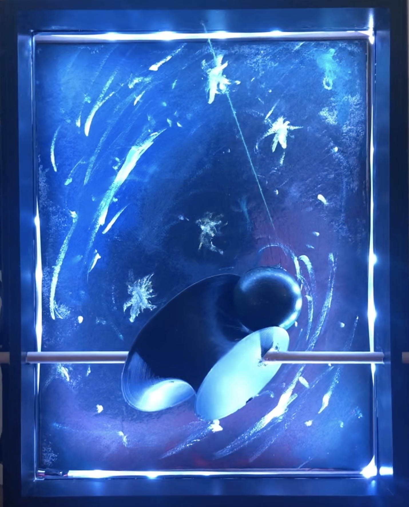
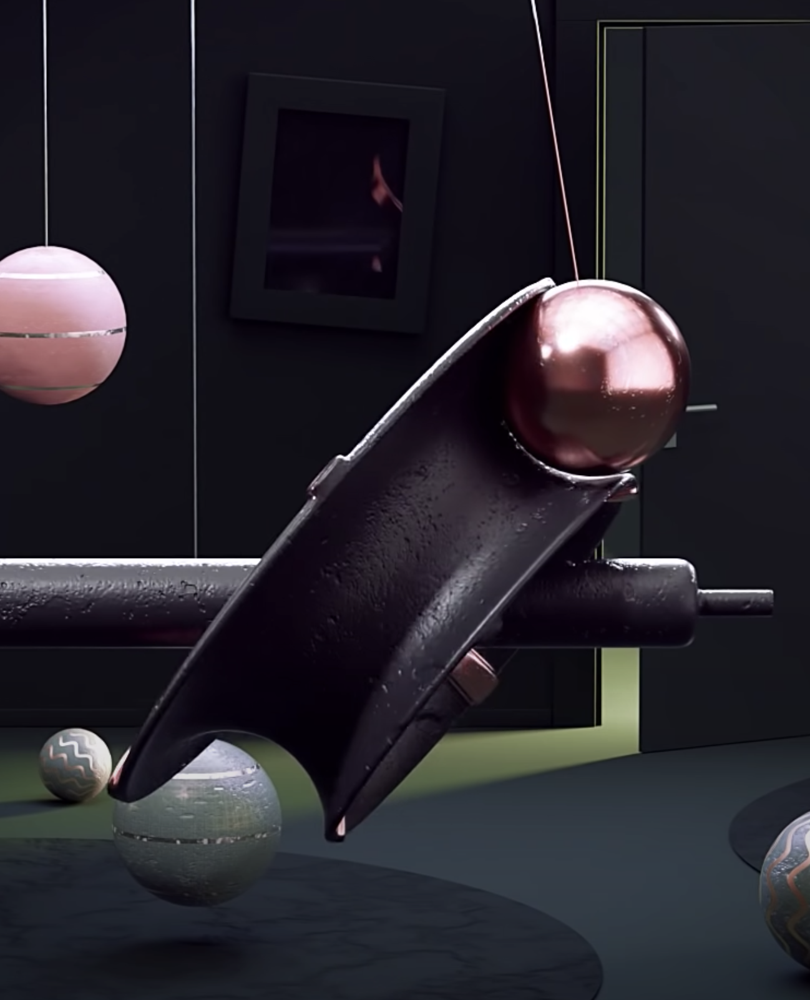
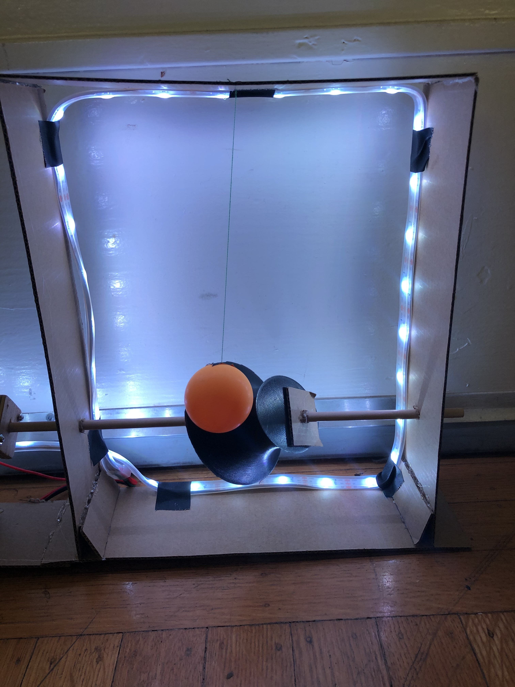
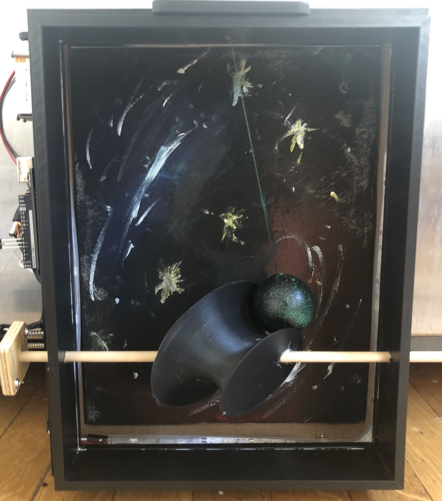
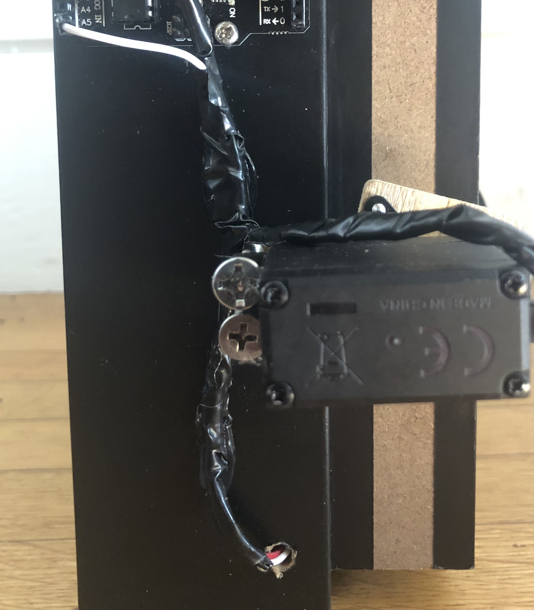
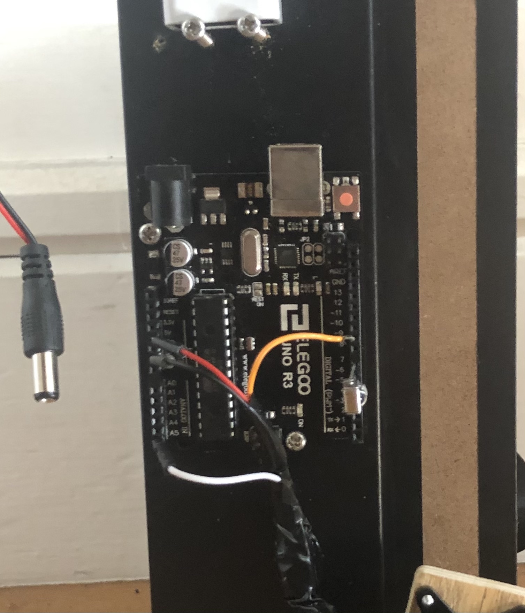
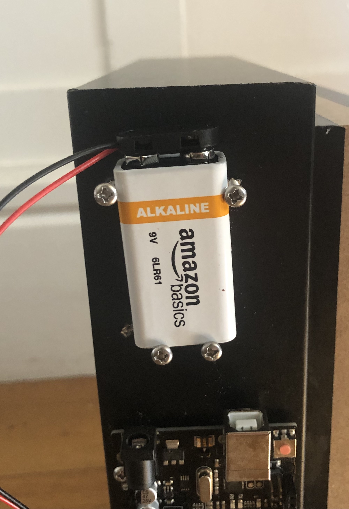
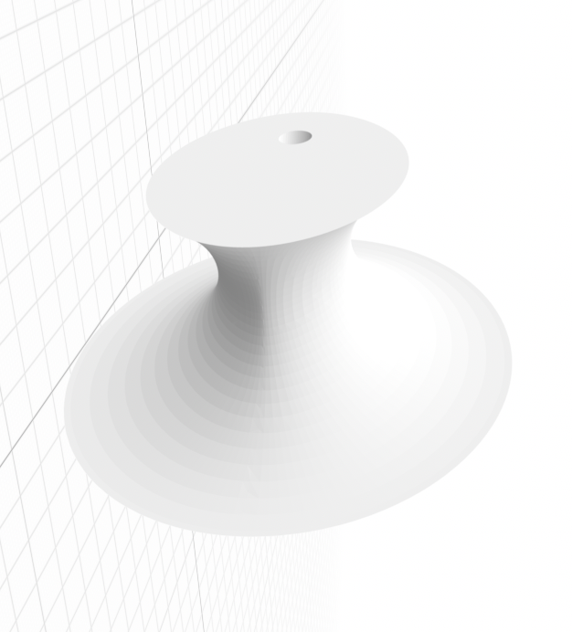
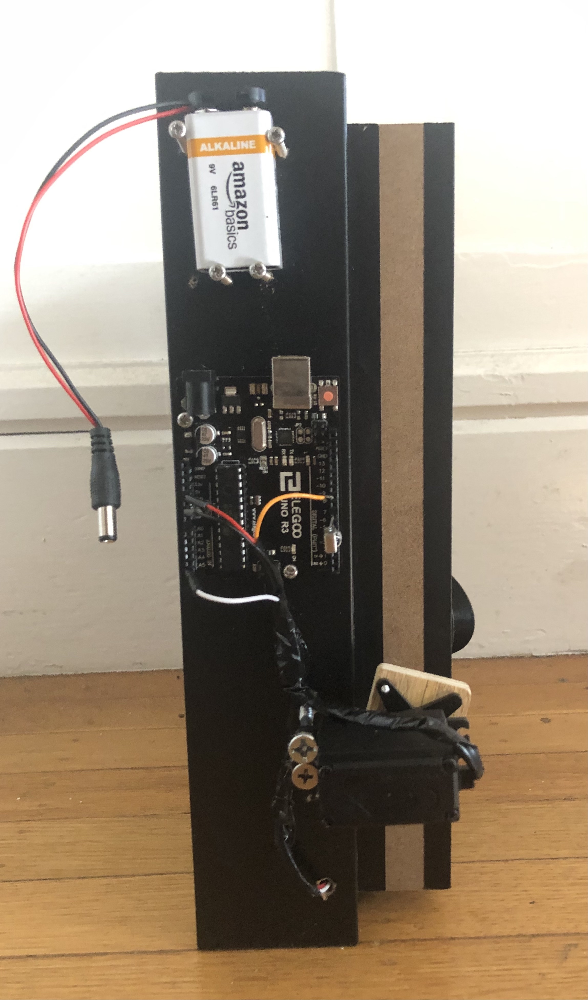

 Jace Bruner | Satisfying Stars | 3/31/2021 
 

Midterm Video: <a href="https://youtu.be/k0vs9TMm_1k">https://youtu.be/k0vs9TMm_1k</a>

## Description
This project was inspired the 3D animation found here: [Link](https://youtu.be/iLRsCtd5P9s?t=427)

The 3D animation depicts a seemingly frictionless world where a ball seemlessly slides over a rotating 3D elyptically shaped obeject. 

The completed project was submitted for the midterm of Design Innovation 23 at UC Berkeley.

## Project Progression

## Primary Challenge
Power a motor to spin a rod or dowel attached to a very unique piece. When this piece spins it should move the ball side to side on a 2D plane and have it swing like a pendulum. Because the unique piece takes an elliptical shape, the ball will be pushed to one side as the ellipse rotates and then will be pushed back in the other direction each time the major axis of the ellipse crosses the axis of the rod it is mounted on. 

Although my device may not be as smooth as the animation, that is to be expected given that I am dealing with real life forces, such as friction, that cannot be avoided like they can be in the animation.

## Hardware
The Continuous Servo:
- Is mounted via two screws a couple centimeters from the wood frame.
- Power and Ground wires are spliced with the Power and Ground wires of the LED light strip below since both features need the same 5V supply.
- Connects to the dowel via a roughly square piece of wood with a hole in the middle for the dowel to connect.
- Receives input from digital pin 9 in the arduino.

 

The Arduino:
- Is mounted via two screws directly on the wood frame.
- Wires to the continuous servo and to the LED light strip.
- Mounts the IR sensor to pick up remote signals.
- Originally I had soldered another wire to the IR sensor and had that connected to the 3.3 volt supply on the arduino, but unfortunately I lost that IR sensor piece when it fell out one time.
  - Luckily I remembered that I could simply change one of the pins on the arduino to output the necessary voltage and thus could place a new IR 
  - Sensor directly into the digital pins without having to wire it to the designated voltage supply.

 

The Battery:
- Is loosely held in place by four screws.
- Powers the arduino.
- Unfortunately while testing I burnt through my last 9V battery and now have to power the device with my laptop until new batteries arrive.
- If I make a new “Satisfying Stars” in the future, I would like to mount another battery since both the servo and LED light strip are fairly power intensive.

 

Unique Piece:
- Changes from the prototype include
  - Decreasing the curve radius such that the curve is sharper.
  - Adjusting the mounting hole to fit the dowel better.

 

Other notes:
- I tried to clean up the project by using heat shrink or wrapping the wires in electrical tape wherever applicable.
- The LED light strip refused to be hot glued to the wooden frame and thus I resorted to screwing in a series of miniature clips I had lying around to keep the strip in place.
- I bought the wood frame on amazon here: https://www.amazon.com/gp/product/B07642GY4B/ref=ppx_yo_dt_b_asin_title_o03_s00?ie=UTF8&psc=1.
  - Unfortunately the frame wasn’t big enough to host my unique cylindrical piece and thus I had to connect another wooden piece to the outside via wood glue.
- I used acrylic paint to paint the backdrop to look like an abstract outer space and I used spray paint to give the ball that oscillates around to look like a planet.
- The piece I bought on amazon is designed to mount to the wall. As a result, “Satisfying Stars” is also very light and easily mountable.

## Complete Side View

## Supply List

1. Wooden frame
2. Wood glue
3. Hot glue/Hot glue gun
4. Wooden dowel
5. 1 cm thick wood
6. Various screws
7. Ping pong ball
8. Arduino
9. 9V battery
10. Continuous servo
11. IR remote and receiver
12. LED light strip
13. Light strip mounting clips
14. String
15. Unique 3D printed piece
16. Option Items
17. Acrylic paint
18. Spray paint
